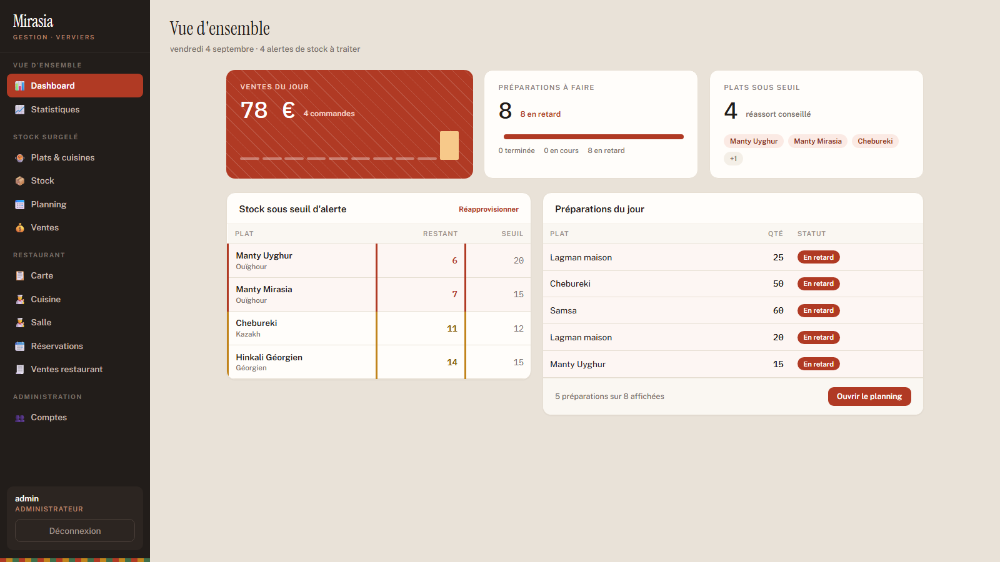
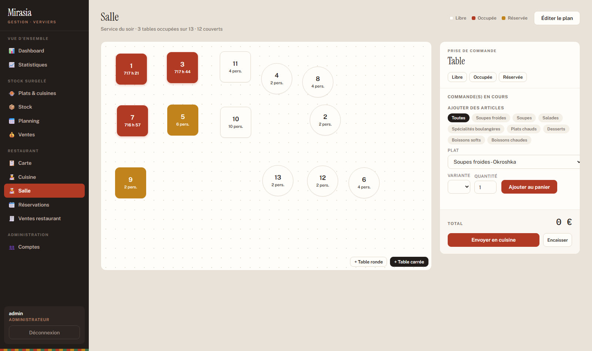
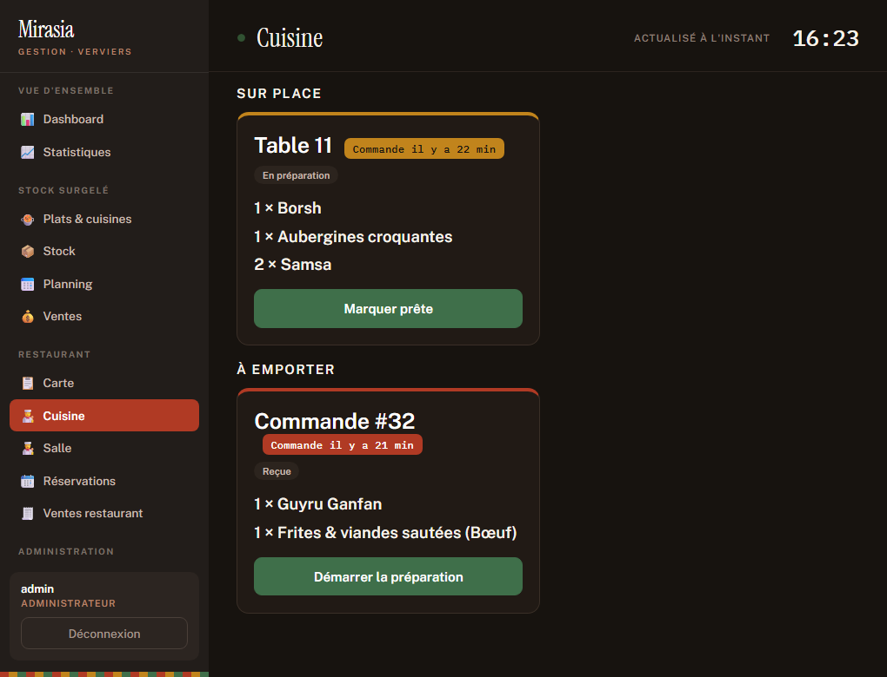
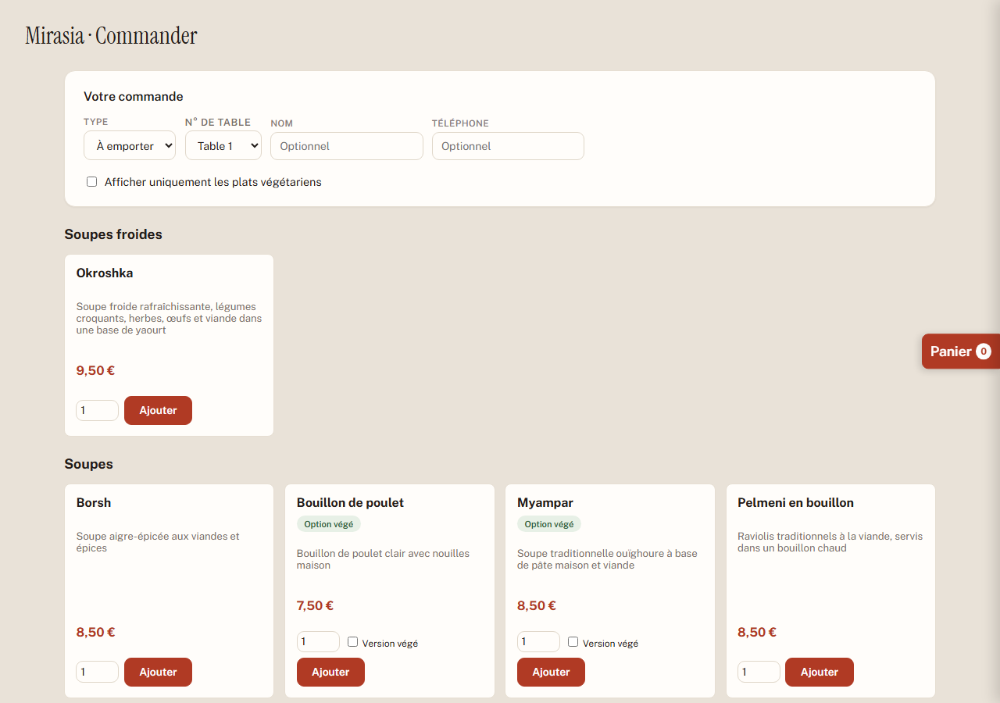

# Ismail Razijev

**Je conçois et livre des applications complètes, avec l'IA comme levier de production.**
Bachelier en Informatique de Gestion, option Développement d'Applications · IPEFA de Verviers, cours du soir

📄 [Mon CV](./cv/CV-Ismail-Razijev.pdf)

---

## À propos

Je me forme aux fondamentaux du développement logiciel : programmation C, bases de données et PL/pgSQL, administration Linux/Bash, développement web.

En parallèle de mes études, je travaille chez Mirasia, un restaurant à Verviers ouvert par mon frère, qui propose une cuisine d'Asie centrale et du Caucase (ouïghoure, kazakhe, ouzbèke, tchétchène, russe, géorgienne). J'ai participé à toute son ouverture. Cette double expérience m'a donné des compétences concrètes en gestion de projet et en mise en place d'outils digitaux pour une petite entreprise, du site vitrine à l'intégration d'outils de gestion.

Je m'intéresse particulièrement à l'application pratique de l'intelligence artificielle dans le développement et la gestion d'entreprise : accélérer la production de code, structurer des projets, optimiser des processus métier.

À travers mes projets, je cherche à allier rigueur technique et sens pratique, avec une approche orientée résultats.

---

## Projets

### [Mirasia Gestion](./mirasia-gestion) · en ligne, développement actif

Application de gestion complète pour le restaurant Mirasia, développée en solo sur un vrai besoin métier : remplacer un suivi manuel du stock, des préparations, des ventes et de la salle.

**Tableau de bord** : ventes du jour, préparations en retard, plats sous seuil d'alerte

**Plan de salle** : tables carrées et rondes déplaçables, états libre / occupée / réservée, prise de commande directe

**Écran cuisine** : commandes sur place et à emporter, actualisées en continu

**Carte et commande client**, accessible sans compte

- **Backend et API** : Node.js / Express, API REST (15 modules de routes), authentification par session, helmet, rate-limiting, logging
- **Base de données** : PostgreSQL (Supabase), 13 tables, 7 migrations SQL versionnées, 2 fonctions PL/pgSQL transactionnelles (ventes FIFO, commande client), 1 trigger d'historique automatique
- **Comptes et rôles** : comptes staff individuels, mots de passe hachés (scrypt), 3 rôles (admin, cuisine, salle) avec navigation et API filtrées
- **Interfaces** : dashboard analytique (ventes du jour, historique 10 jours, préparations, plats sous seuil), plan de salle personnalisable avec tables déplaçables et durée d'occupation réelle, écran cuisine, carte publique, commande client, réservations
- **Identité visuelle** propre, maquettes conçues sur claude.ai/design
- **Qualité et déploiement** : 31 tests d'intégration automatisés (node:test + supertest), Dockerfile et docker-compose, mise en ligne sur Render
- **En cours** : websockets pour l'écran cuisine en temps réel, notifications automatiques sur alertes de stock, module caisse

**Stack** : Node.js, Express, PostgreSQL, PL/pgSQL, Docker

🔗 **[Démo publique, carte et commande client](https://mirasia-gestion.onrender.com/commande.html)**
🔗 [Espace de gestion](https://mirasia-gestion.onrender.com/login.html) · identifiants de démonstration disponibles sur demande

> Hébergée sur le plan gratuit de Render : le premier chargement peut prendre 30 à 60 secondes, le temps que le serveur se réveille.

---

### Entraîneur PL/pgSQL · dépôt privé

Application web locale d'entraînement au PL/pgSQL à correction automatique. L'étudiant écrit une fonction, elle est **réellement exécutée contre PostgreSQL**, puis corrigée cas de test par cas de test, avec le résultat attendu en face du résultat obtenu.

- **183 exercices et 507 cas de test** sur 4 bases de données montées automatiquement par un script d'installation
- **Exécution isolée** : chaque soumission tourne dans une transaction annulée, sans jamais altérer les données de référence, avec coupure des boucles infinies par timeout
- **Aucun appel réseau, aucune IA à l'exécution** : la correction est déterministe, tout tourne en local
- Couvre l'intégralité d'un syllabus universitaire : procédures stockées, requêtes paramétrées, séquences, déclencheurs, expressions régulières
- Séparation des droits documentée : le programme est sous licence MIT, les énoncés et jeux de données restent la propriété de leur auteur

**Stack** : Node.js, PostgreSQL, PL/pgSQL

Dépôt privé, démonstration sur demande.

---

### [Meeting Notes AI](./meeting-notes-ai)

Analyseur de comptes rendus de réunion propulsé par l'API Claude. Une transcription brute en entrée, un compte rendu structuré en sortie : résumé, décisions, actions à suivre.

- Gestion des erreurs d'API (clé invalide, rate limit, connexion), clé sécurisée en variable d'environnement
- Testé sur plusieurs cas d'usage : réunion normale, réunion sans décision, transcription désordonnée
- **V2 en préparation** : upload audio avec transcription automatique, enregistrement direct depuis l'application

**Stack** : Python, API Anthropic, Streamlit

🔗 [Démo en ligne](https://portfolio-7q2shyofrzputy8ltgnpmw.streamlit.app)

> Hébergée sur Streamlit Community Cloud : l'application se met en veille après une période d'inactivité. Si un écran « Zzzz » s'affiche, un clic sur « Yes, get this app back up! » la relance en une trentaine de secondes.

---

## Me contacter

- **Email** : razijevismail@gmail.com
- **GitHub** : [github.com/ismail-razijev](https://github.com/ismail-razijev)

